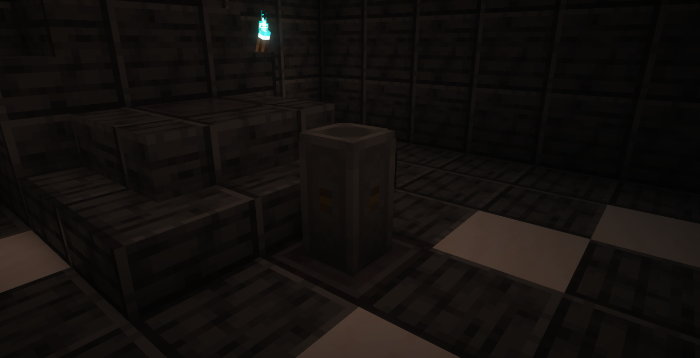
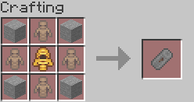

# Charter Stone <Badge type="warning" text="Preview Content" />

The Charter Stone is the main component of your "Charter".

## Usage

Upon placing a Charter Stone down, it will create a [Charter](../mechanics/charters) with a 
32x32 area with the stone at the centre. Read more about how Charters work on their
respective page.

## Appearance

The Charter Stone is a big, vertical piece of stone with dots on the sides.

The Charter Stone block.

## Obtaining

The Charter Stone can be crafted, you will need:  
<input type="checkbox"> **Four** stone blocks;  
<input type="checkbox"> **Four** [Pawns](./pawn);  
<input type="checkbox"> **One** [Merchant Effigy](../items/merchant-effigy);

The Charter Stone crafting recipe.
