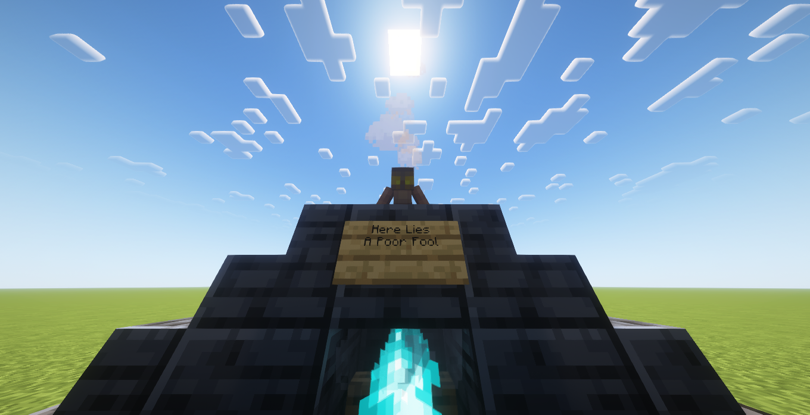
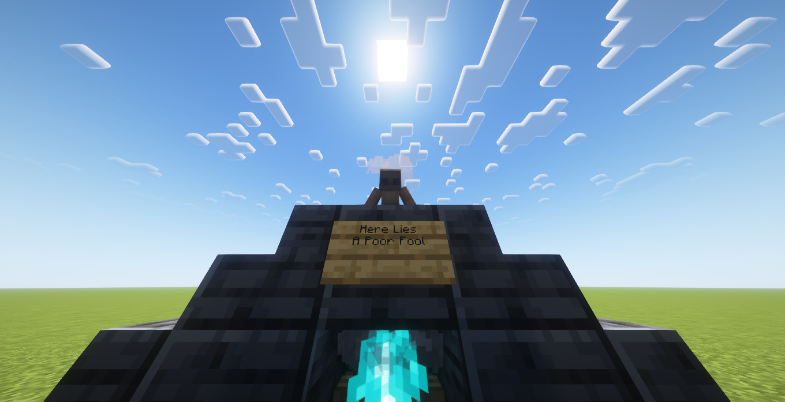
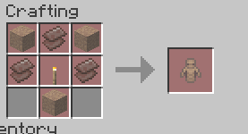

# Pawn <Badge type="warning" text="Preview Content" />

The Pawn is an extremely versatile block used to control people in debt or contracted to you.

## Usage

You can light a pawn by right-clicking it with a signed [Contract](../items/contract).

Once lit, you can do certain things to the block that will reflect upon the linked person.

### Breaking

Breaking the pawn will result in the immediate death of the contractee. In the future, the following
sound will be played:

<audio controls src="./blast.ogg">
Your browser does not support the audio element.
</audio>

### Using a nametag

Using a nametag on the pawn will change the name of the contractee to whatever is on the nametag.
Do note that this requires the contractee to be in [Debt](../mechanics/debt) to you!

### Pact Vessel

The older versions had a block called the "[Pact Vessel](https://ladysnake.org/wiki/charter#-pact-vessel)",
which was used to make a player trusted in a Charter. The Pact Vessel has a strikingly similar
appearance to the Pawn, and as such, it is speculated that the Pawn will have a similar
function in the final release.

## Appearance

The Pawn is a small block, looking like a puppet with its head bowing down.
It has two 2x2 pixel eyes, that are yellow when the pawn is lit up.

It has no mouth, as it ain't gotta scream...

### Lit up

### Unlit

## Obtaining

The Pawn can be crafted, you will need:  
<input type="checkbox"> **Three** packed mud;  
<input type="checkbox"> **Three** netherite scraps;  
<input type="checkbox"> **One** torch;

The Pawn crafting recipe.
