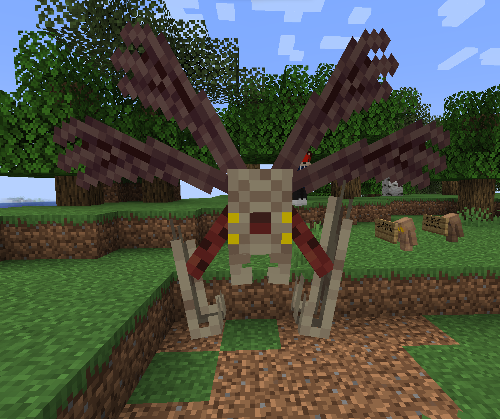

# Bloodfly <Badge type="danger" text="Cut Content" />

Bloodflies are experimental flying mobs that were cut from the final release.

## Behaviour
Their behaviour is similar to Phantoms, they circle in the sky and attack players
by swooping down on them. However, if the player gets hit during this swoop, the Bloodfly
will pick them up and fly away with them. The player can dismount them at any time, 
the Bloodfly will never let go themselves, so players need to find a good moment to get rid
of them.

## Appearance
Bloodflies have a rectangular, vertical torso, with two pairs of two wings on the top to the sides.
They have four one-pixel yellow eyes, and a red sorta-nose in the middle.
Emerging from the side of the torso are two legs connected to a big gripper,
which is where the player is positioned when picked up.


<div class="subtitle">The Bloodfly in game.</div>

## Obtaining

The Bloodfly does not spawn naturally, nor does it have a spawn egg. 
As such, you need to summon it using commands:
```
/summon charter:bloodfly
```