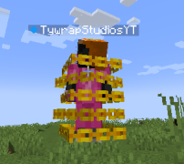

# Chains

Chains are entities that appear on users of the [Merchant Effigy](../items/merchant-effigy) upon
death.

## Behaviour
The Chains will swirl around the user, keeping them locked in place.

### Defense
The Chains will defend the user from other mobs and damage sources, and prevent the
user from dying.

### Entrapment
The Chains prevent the user from moving, fighting, and any interaction at all.

The user can be freed by someone simply hitting the chains.

### Looting
Anyone can loot the user's inventory while they are trapped by right-clicking
the chains.

## Appearance
The Chains are made out of a yellow, gold-like material, consistent with
more items in Charter. A total of five chains swirl around the user horizontally.


<div class="subtitle">Chains circling around TywrapStudiosYT, after they used the <a href="../items/merchant-effigy">Merchant Effigy</a>.</div>

## Obtaining
The Chains do not have a spawn egg, and are instead summoned when a user
dies while in posession of a signed [Merchant Effigy](../items/merchant-effigy).

Alternatively, they can be summoned using commands:
```
/summon charter:chains
```
However, they will immediately despawn if they don't have a user attached to them.