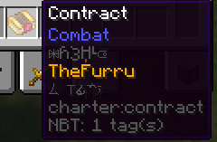
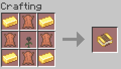

# Contracts

The Contract is the Heart of Charter, and is used for all sorts of things.

## Usage

The Contract is used to sign agreements between two players. Signing it will place a 
red dot in the middle of the texture, and add your name to it. The obfuscated text in
the tooltip reads:
```
Behold,
[username].
A fool.
```

---


<div class="subtitle">A contract signed by TheFurru in an inventory.</div>

Once signed, a contract can be placed inside a [Pawn](../blocks/pawn), or be used
to obtain the contracted person's [arm](./arm#arm-survival) once [indebted](../mechanics/debt).

Alongside this, the contractor can blind the contracted person once [indebted](../mechanics/debt) by 
holding a spider eye in their offhand and then hitting them with the contract in their main hand.

::: danger
This action is irrevocable, and will blind the contracted person **permanently**.

The only way to get rid of the blindness, is by modifying your player data, or simply
recreating the world. Read more about that [here](#retrieve-vision).

_As such we highly suggest not doing this in an important world!_
:::

## Obtaining

The Contract can be crafted, you will need:  
<input type="checkbox"> **Four** gold ingots;  
<input type="checkbox"> **Four** pieces of leather;  
<input type="checkbox"> **One** wither rose.


<div class="subtitle">The Contract crafting recipe.</div>
