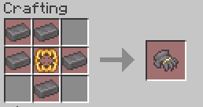
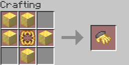

# Gauntlets <Badge type="danger" text="Cut Content" />

The Gauntlets are pairs of items that can be used as a combat tool. You use them to
telekinetically throw and manipulate swords around.

There are currently two types of Gauntlets: the Advance Gauntlets and the Bastion Gauntlets.

## Gauntlet Modes

Gauntlets have different modes that can be switched between through various means,
but before you can use them, you must first deploy your swords.

### Deploying Swords
1. Hold two Gauntlets in your main and offhand with swords in your hotbar;
   - Note that they don't have to be of the same type, however, only the modes of the 
   Gauntlet in your main hand will be available.
2. Press <kbd>Shift</kbd> + <kbd>LMB</kbd> to deploy the swords. This also immediately puts
you into `IDLE` mode.

### Advance Modes
These modes are exclusive to the **Advance Gauntlets**.

> <kbd>Shift</kbd> + <kbd>LMB</kbd>: `IDLE`  
> Swords will be taken from your inventory and added
> to the ring of swords that swirls around your head.  
> <a href="./gauntlet-modes/idle.png" data-fancybox="gallery" data-caption="Swords in IDLE">View Image</a>

> <kbd>RMB</kbd>: `WHEEL`  
> All the swords will swirl in two circles, which will intersect
> each other on both the front and back, around your head at a small angle.  
> <a href="./gauntlet-modes/wheel.png" data-fancybox="gallery" data-caption="Swords in WHEEL">View Image</a>

> <kbd>LMB</kbd>: `BLADE`  
> All your swords will form one big line of swords all in front of each other. 
> There is no physical limit to how long this can get as long as you provide enough swords,
> so be careful!  
> <a href="./gauntlet-modes/blade.png" data-fancybox="gallery" data-caption="Swords in BLADE">View Image</a>

### Bastion Modes
These modes are exclusive to the **Bastion Gauntlets**.

> <kbd>RMB</kbd>: `SHIELD`  
> Creates an orbit/swarm of swords around you. This works with any amount
> of swords, and they will be dispersed evenly to cover as much area as possible. 
> This is more effective as a defence mechanism per sword you add, as it starts to act more
> and more like a shield.  
> <a href="./gauntlet-modes/shield.png" data-fancybox="gallery" data-caption="Swords in SHIELD">View Image</a>

> <kbd>LMB</kbd>: `SWEEP`  
> Sends all the swords, shaped into a circle, in the direction you're looking at.  
> <a href="./gauntlet-modes/sweep.png" data-fancybox="gallery" data-caption="Swords in SWEEP">View Image</a>

### Other "Modes"

These modes are available for **both types of Gauntlets**.

> <kbd>Shift</kbd> + <kbd>RMB</kbd>: `COLLECT`  
> Collects and retrieves all the swords back into your inventory.

## Enchanting

Swords will keep their enchantments when added to your arsenal, and will actually use 
them when interacting with entities. E.g., a sword with Fire Aspect will set
the target on fire when hitting them.

<a href="./gauntlet-modes/enchanted-idle.png" data-fancybox="gallery" data-caption="Swords with Fire Aspect in IDLE">View Image</a>

## Obtaining

The Gauntlets can be crafted.

To craft the Bastion Gauntlets, you will need:  
<input type="checkbox"> **Five** netherite ingots;  
<input type="checkbox"> **One** [Hoarder Maw](./hoarder-maw).

The Bastion Gauntlet crafting recipe.

To craft the Advance Gauntlets, you will need:  
<input type="checkbox"> **Five** gold blocks;  
<input type="checkbox"> **One** [Hoarder Maw](./hoarder-maw).

The Advance Gauntlet crafting recipe.

---

Huge thanks to the following people for the imagery provided, and their help
in testing and finding all the different modes:

<VPTeamMembers size="small" :members />
