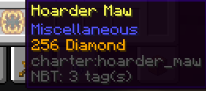
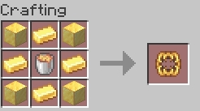

# Hoarder Maw

The Hoarder Maw can be used like a bundle to store infinite amounts of stackable items, 
but only one type of item at a time.
As an example: you can have 165 diamonds in a hoarder maw, but cannot add a single oak log without 
taking the diamonds out first.

## Usage 
Add items to the Maw by right-clicking on it in the inventory with the item.

## Obtaining

The Hoarder Maw can be crafted, you will need:  
<input type="checkbox"> **Four** gold blocks;  
<input type="checkbox"> **Four** gold ingots;  
<input type="checkbox"> **One** lava bucket.

The Hoarder Maw crafting recipe.
