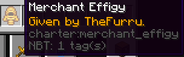
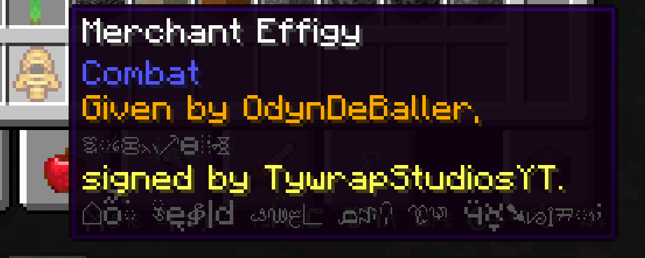
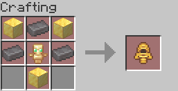

# Merchant Effigy

The Merchant effigy is an item similar to the Contract. 
It can be used for a form of immortality, being a sort of upgraded Totem of undying.

## Usage 

Upon being crafted, it will immediately put a text in its tooltip:
```
Given by [username].
```

---


<div class="subtitle">The Merchant Effigy in the inventory, after crafted by TheFurru.</div>

### Giving Effigies

Merchant Effigies can be given to another player, preferably one that you have a [contract](./contract) with,
as a sort of reward or gift for their service or reason of debt. Once they right-click the effigy
while holding it, they sign the effigy. This adds "signed by [receiver's username]" to the tooltip,
as well as some obfuscated text. In the end, unobfuscated, the tooltip reads:

```
Given by [giver's username],
foolishly
signed by [receiver's username].
Let their fate act as warning.
```

---


<div class="subtitle">The Merchant Effigy given by OdynDeBaller after being signed by TywrapStudiosYT.</div>

An effigy cannot be signed by its giver.

### Immortality

Dying while having a signed effigy in your inventory will save you from death, similar to
a Totem of Undying, alongside not being consumed in the process. Once this happens, you will be
chained and, as such, locked in place. The [Chains](../entities/chains) entity is summoned upon the user, and comes with
a fair share of consequences. Read more about those in the [Chains](../entities/chains) documentation.

Alongside this, the effigy will impose [Debt](../mechanics/debt) on the user, making them permanently indebted
to the giver.

The item works similar to the [Eternal Pact](https://ladysnake.org/wiki/charter#-eternal-pact-) 
from older versions as it also renders you immortal. However, the consequences are
different and are imposed based on health, rather than your current state of
being alive or dead.

## Obtaining

The Merchant Effigy can be crafted, you will need:  
<input type="checkbox"> **One** totem of undying;  
<input type="checkbox"> **Three** gold blocks;  
<input type="checkbox"> **Three** netherite ingots.


<div class="subtitle">The Merchant Effigy crafting recipe.</div>
