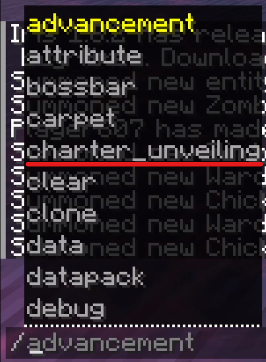

# Charter Borders

An image was leaked that led to speculations that you might be able to
visualise Charter Borders (a.k.a. their [walls](../mechanics/charters#wall))
using a command.

The leaked image with the borders.

## Big Charter Stone
Note that in this image, another thing can be seen which is essentially a very big
sort of wrench-shaped stone. In one of the videos of Content SMP, we can see this
acting as a sort of upgrade to the Charter Stone, providing a lot larger area of coverage.
Its exact use and mechanics remain unknown, and this is quite speculative.

## Command
In another image, we can see a command that might be linked to this phenomenon. It is
likely ran to toggle between visualised or hidden borders.

The Visualise Borders command in game.
