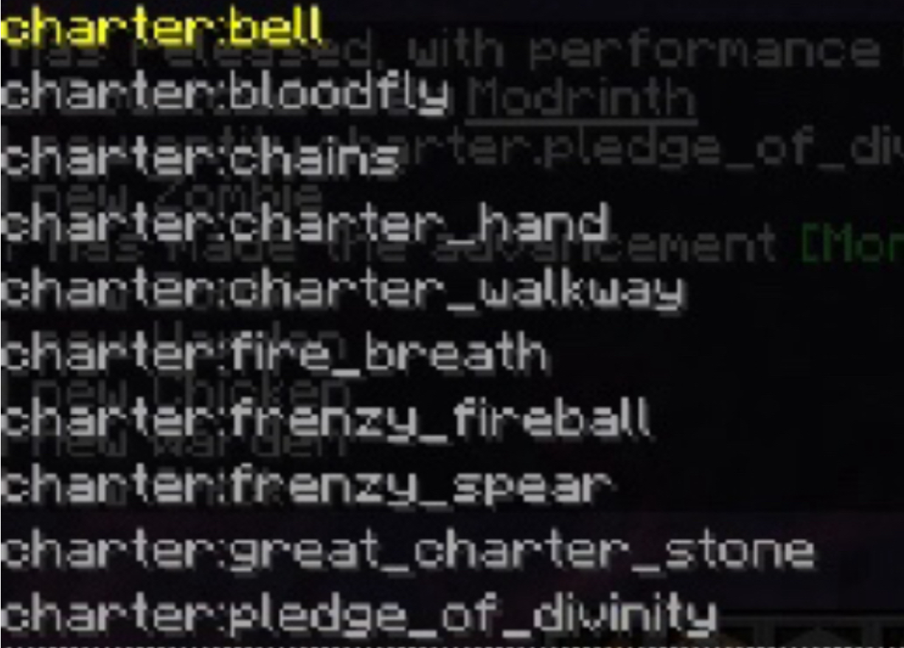
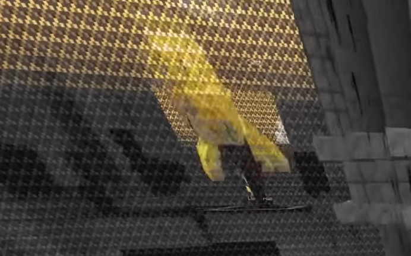
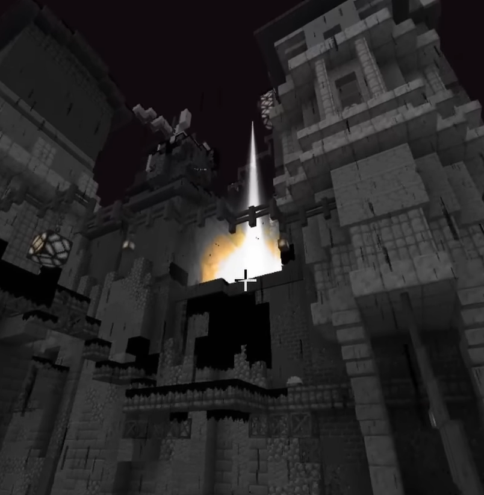
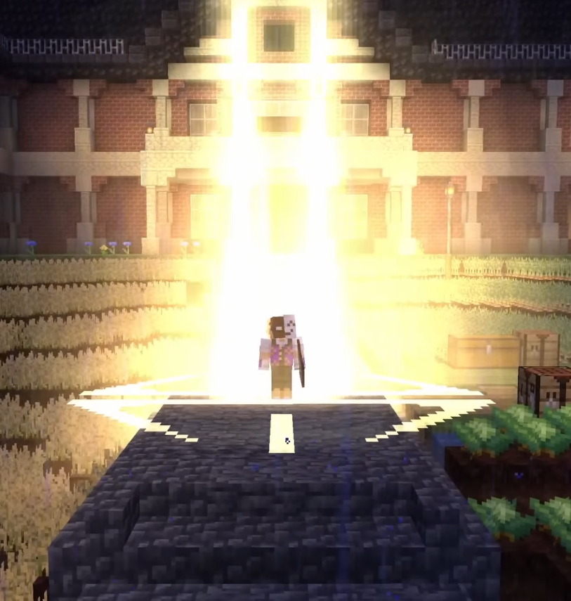

# Entities
There's a (non-inclusive?) list of all entities that are presumably in (some dev version of?) Charter.

Arathain once sent a video showcasing the Lesser Divinity Beam. While doing so, he summoned a zombie
using `/summon`, and the suggestions showed a list of entities in Charter.

The leaked image with the list of entities in chat.

## Speculations
We can only speculate about what these entities are, however, some are also already known.

### `bell`: The Bell {#bell}
Unknown

### `bloodfly`: The Bloodfly {#bloodfly}
See [Bloodfly](../entities/bloodfly).

### `chains`: Chains {#chains}
See [Chains](../entities/chains).

### `charter_hand`: Charter Hand {#charter_hand}
Likely the hand crushing Luxintrus in RAT's [latest CSMP video](https://youtu.be/kNPDNK02m2M?t=11485).

The Charter Hand from <a href="https://youtu.be/kNPDNK02m2M?t=11485">RAT's perspective</a>.

### `charter_walkway`: Charter Walkway {#charter_walkway}
Quite unknown. 

It is speculated this might be some sort of rift bringing someone in via the Divine Dominance. 
It may also be the beam that gives the final blow to Luxintrus after the [Charter Hand](#charter_hand).

The Speculated Charter Walkway from <a href="https://youtu.be/kNPDNK02m2M?t=11501">RAT's perspective</a>.

### `fire_breath`: Fire Breath {#fire_breath}
Unknown

### `frenzy_fireball`: Frenzy Fireball {#frenzy_fireball}
Probably a fireball-shooting ability you can use when you're in a so-called "Frenzy",
whatever that may be. May be related to the [Irritated Eye effect](./other#irritated-eye).

### `frenzy_spear`: Frenzy Spear {#frenzy_spear}
Probably a spear-like ability you can use when you're in a so-called "Frenzy",
whatever that may be. May be related to the [Irritated Eye effect](./other#irritated-eye).

### `great_charter_stone`: The Greater Charter Stone {#great_charter_stone}
See [Greater Charter Stone](./charter-borders#greater-charter-stone).

### `pledge_of_divinity`: The Pledge of Divinity {#pledge_of_divinity}
The beam of the Lesser Divinity.

The Pledge of Divinity acting on Blake WinSweep from RAT's <a href="https://youtu.be/kNPDNK02m2M?t=5">latest CSMP video</a>.
