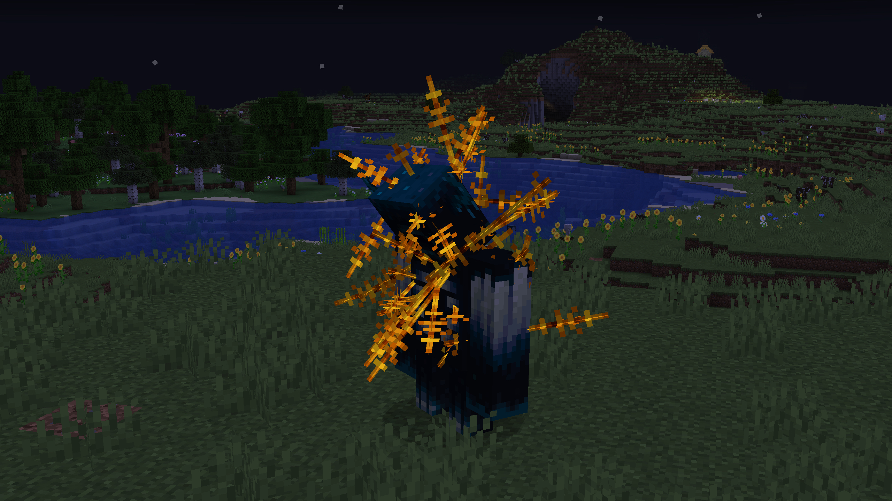
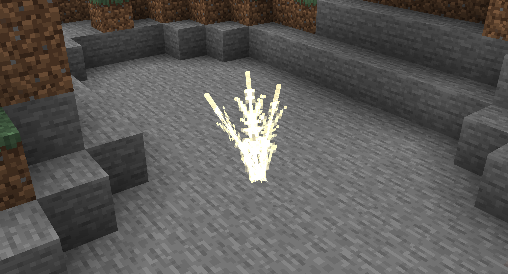
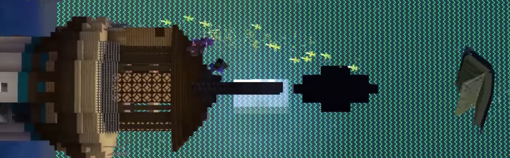
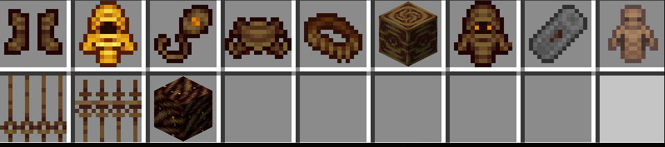
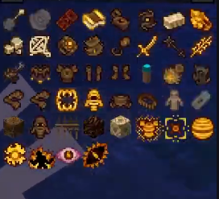
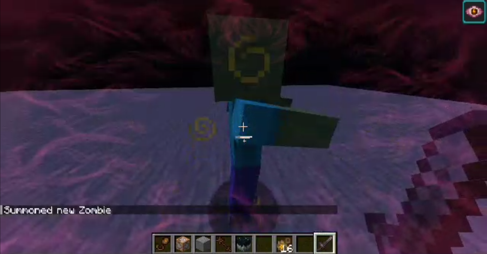
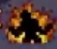

# Other Leaks

There are also a few general-image leaks that don't really fall into
one of the beforementioned categories or relations.

## Prickly Warden

The Prickly Warden.

The Warden in this image seems to be attacked in some way with prickly objects
(Possibly the [Frenzy Spears](./entities#frenzy_spear)?) that stay on the entity similar
to arrows. Not much is known about them.

## Some Arrow

The arrow-like projectile pointed into the ground.

These arrows look strikingly similar to the Grimoire ex Moriyissiles that the
Grimoire ex Moriya shoots during the fight at 
[Gitaly with WinSweep](https://www.youtube.com/watch?v=LY7GKE77gaA&t=1909s).

The Grimoire ex Moriyissiles in <a href="https://youtu.be/LY7GKE77gaA?t=1972">WinSweep's video</a>.

## Textures and Items

Some Charter items in the Creative Menu.

Some Charter items in the JEI menu.

The last few items in the JEI menu look more like status effect icons. One example of this is the
[Irritated Eye](#irritated-eye).

## Irritated Eye

The Irritated Eye effect.

We aren't quite sure what this does, however, it might be related to
the Frenzy stuff referenced throughout other leaks such as the 
[entity list](./entities#frenzy_fireball).

> A frenzy is a state of intense, uncontrollable excitement, wild behaviour, or temporary madness.  

This effect could definitely hint at this "Frenzy" mechanic.

On the other hand, another icon in the JEI list at [Textures and Items](#textures-and-items)
looks like a man in a maniacal pose on fire, which on its turn also fits for the definition
of a Frenzy, so who knows.

The other possible Frenzy effect icon from the JEI list.

